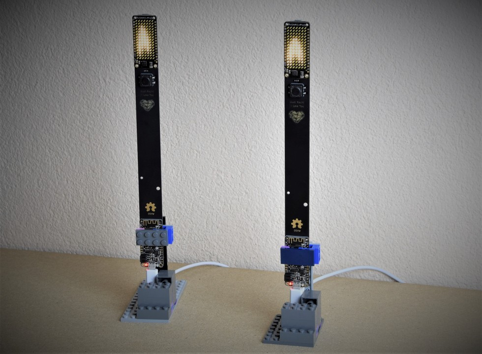
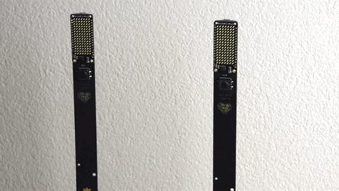

# Feather Candle "_Guet Nacht - I Love You_"
## 15x7 LED matrix candle based on Adafruit Feather HUZZAH (ESP8266)

---

## Introduction

This electronic project is intended as a romantic gimmik for two long distance lovers.
The candle is connected to the io.adafruit.com cloud over WiFi.

> Whenever one person turns on their own candle, the candle of their lover - on the other side of the world - will light up as well.

The project is built around the Adafruit Feather boards and uses the 15x7 LED matrix and the WiFi enabled Feather HUZZAH board based on the ESP8266 microcontroller. The IoT handling is built around the MQTT service of [io.adafruit.com](https://io.adafruit.com).

### The Name

**_"Guet Nacht"_** is wishing a good night in Swiss German. When I was working on this project I said good night to my loved person by telling them _"Guet Nacht - I love you"_. Ultimately I decided that this is the codename for this project.

---

## Hardware

There are three different variants for the hardware configuration which ultimately determines the functionality and software capabilities. **Yes you can built just the candle without WiFi.**

The candle can also be hung from the ceiling.

### Variant 1: Trinket (just the candle)

This is the most simple and straight forward variant. The essential parts are the [Adafruit 15x7 CharliePlex LED Matrix FeatherWing](https://www.adafruit.com/product/3163) and the [Adafruit Trinket M0](https://www.adafruit.com/product/3500).
This variant is just the candle powered over micro USB.
The micro USB connector is at the top (where the flame is) so the candle could be hanged from the ceiling. Alternatively you can add a [USB Micro-B Breakout Board](https://www.adafruit.com/product/1833) at the bottom of the board to power the candle at the socket.

### Variant 2: Feather (just the candle)

This variant is driven by any Feather board capable of compiling the candle animation sketch. The Feather boards provide an on-board battery charger. At the back of the candle's PCB there is space for a [Keystone 1042P](http://www.keyelco.com/product.cfm/product_id/918) battery holder for a 18650 3.7V battery (this feature is not tested).

### Variant 3: HUZZAH (WiFi enabled)

This is the original Idea. The Trinket holds the code for the flame animation while the Feather HUZZAH is connected to the Adafruit IO cloud. This variant can also be powered by a battery like variant 2. 

##### Battery

This feature remains **untested**. 
Also note that the ESP8266 uses a significant ammount of power, up to 170mA when transmitting data over Wifi ([source](https://bbs.espressif.com/viewtopic.php?t=133)). This may result in very short battery service life).

---

### Building Variant 3

#### Bill of materials (BOM)

This is the partlist for the WiFi enabled candle. 

| Description | Value | Manufacturer | Pcs. | Part. Nr. (mouser) | price (estimation) |
|-------------|------:|--------------|-----:|-------------------:|------------------------:|
| Candle PCB | - | - | 1 |  | $ 10.00 |
| 15x7 CharliePlex LED Matrix FeatherWing (warm white) | - | [Adafruit (3163)](https://www.adafruit.com/product/3163) | 1 | [485-3163](https://www.mouser.com/ProductDetail/Adafruit/3163?qs=%2fha2pyFaduh%252brbpYDT4hI1KcasFFaXTHrw3K2WUgkuI%3d) | $ 13.30 |
| Feather HUZZAH with ESP8266 WiFi | - | [Adafruit (2821)](https://www.adafruit.com/product/2821) | 1 | [485-2821](https://www.mouser.com/ProductDetail/Adafruit/2821?qs=%2fha2pyFadujIGPK6Sj3t4nFuChuwEnz5Imbr6Do1gT8%3d) | $ 18.00 |
| Trinket M0 | - | [Adafruit (3500)](https://www.adafruit.com/product/3500) | 1 | [485-3500](https://www.mouser.com/ProductDetail/Adafruit/3500?qs=%2fha2pyFadugsjdovVS3NFiBTcocohBou1VlJ%2f0Oc5Cc%3d) | $ 9.20 |
| 18650 battery clip SMT | - | [Keystone Electronics](http://www.keyelco.com/product.cfm/product_id/918) | (1) | [534-1042P](https://www.mouser.com/ProductDetail/Keystone-Electronics/1042P?qs=%2fha2pyFadujc2h3Qsi2FB10kgPaLAXTlnLXyd23eJ7VFgPTKWvV%2fxw%3d%3d) | $ 3.10 |
| 18650 Li-Ion battery 3.7V | - | - | (1) |  |  |
| Resistor SMD 1206 | 10k | - | 2 | 
 | $ 0.10 |
| Resistor SMD 1206 | 330R | - | 1 |  | $ 0.10 |
| LED 0805 | - | - | 1 |  |  |
| Pushbutton SMD 12mm | - | - | 1 | eg. [611-PTS125SK43SMTR2](https://www.mouser.com/ProductDetail/611-PTS125SK43SMTR2) | $ 0.50 |
| Pushbutton SMD 6.2mm | - | - | 1 | eg. [611-KSC701GLFS](https://www.mouser.com/ProductDetail/611-KSC701GLFS) | $ 0.50 |
| Capacitor SMD 1206 | 100uF | - | (2) |  |
| Capacitor SMD 0805 | 0.1uF | - | (2) |  |
| USB Micro-B Breakout Board | - |[Adafruit (1833)](https://www.adafruit.com/product/1833) | (1) | [485-1833](https://www.mouser.com/ProductDetail/Adafruit/1833?qs=sGAEpiMZZMsMyYRRhGMFNlzK0q9uz4bUWJaCPx97HuA%3d) | $ 1.50 |
| **Total** * |  |  |  |  | **~$ 50.00** |

> (* The prices are just an estimation. Especially the PCB can only be ordered in larger quantities (>5 pcs).)

> **Important:** The above parts are just for **one** board. In order to build the two connected candles each component is required twice the ammount listed.

> **Notes** 
> - You can either place a 12mm or a 6.2mm push button on the front. (You also need a 6.2mm button on the back).
> - The USB Micro-B Breakout Board is optional for the **variants 1 & 2** (not required on variant 3)
> - **optional**: the capacitors are not required
> - **optional**: the battery holder and the 18650 battery are optional (only work on a **feather variant (2 & 3)**)

#### PCB

You can download the manufacturing files (Gerbers) and use them to order the PCBs from a PCB manufacturer of choice. I recommend using **black solder mask** and **ENIG** surfacing.

Places where you can order custom circuit boards (selection):

> - [OSH Park](https://oshpark.com/)
> - [Aisler](https://aisler.net/products/boards)
> - [DirtyPCBs](http://dirtypcbs.com/store/pcbs)
> - [Elecrow](https://www.elecrow.com/pcb-manufacturing.html)
> - [PCBCart](https://www.pcbcart.com/)
> - ([Aliexpress](https://www.aliexpress.com/category/521/pcb-pcba.html))

---

## Sorftware

Setting up the Arduino IDE:

> - Download the [Arduitno IDE](https://www.arduino.cc/en/Main/Software)
> - How to up the [Adafruit Trinket M0](https://learn.adafruit.com/adafruit-trinket-m0-circuitpython-arduino/arduino-ide-setup)
> - How to up the [Adafruit Feather HUZZAH](https://learn.adafruit.com/adafruit-feather-huzzah-esp8266/using-arduino-ide)

#### Libraries

The following libraries are required to compile the software in the Arduino IDE.

> - [ESP8266 Arduino](https://github.com/esp8266/Arduino) 
> - [Adafruit IS31FL3731](https://github.com/adafruit/Adafruit_IS31FL3731) 
> - [Adafruit MQTT](https://github.com/adafruit/Adafruit_MQTT_Library) 
> - [Arduino Json](https://github.com/bblanchon/ArduinoJson) 
> - [Wifi Manager](https://github.com/tzapu/WiFiManager) 

### `FeatherCandleTrinket.ino`

This is the Arduino code for the Trinkete M0 which you will need for Variants 1 and 3.

**Note for Variant 1** (just the candle):
You might need to comment the `pinMode(PIN_ONOFF_WEB, INPUT);` on `line 68` so that the input isn't floating and randomly switching the flame on and off.

### `FeatherCandleFeather.ino`

This is the Arduino code soley for Variant 2 where the matrix is powered by any Feather microcontroller board.

### `FeatherCandleHuzzah.ino`

This is the Arduino code you need for the WiFi enabled Variant 3. This goes to the Feather HUZZAH board to connect to the Adafruit IO cloud and control the Trinket M0.

---

## Manual

### Setup the candle (WiFi)

The first time you turn on the candle you will have to configure the WiFi and the MQTT parameters. Luckily the software has a configuration portal built in, so you won't have to hardcode these parameters into the Arduino file.

> This way you can give away a candle to someone who does not know how to program.

### Signing up for Adafruit IO

You need to:
- create an Adafruit account
- log in to [io.adafruit.com](https://io.adafruit.com)
- create a new feed called `candle`

You need the following values to continue:
- `username` (find it on [accounts.adafruit.com](https://accounts.adafruit.com/))
- `key` (find it on [io.adafruit.com](https://learn.adafruit.com/mqtt-adafruit-io-and-you/getting-started-on-adafruit-io#where-to-find-your-adafruit-dot-io-key))
- `feed` (the feed your just created: `candle`)

You can find more detailed instructions on how to get started with Adafruit IO on Adafruit's learning platform: [learn.adafruit.com](https://learn.adafruit.com/mqtt-adafruit-io-and-you/getting-started-on-adafruit-io)

**If you give away one candle to your lover:**

> **Important** Both candles require the same values for `username` / `key` / `feed` in order to be synchronized.

Your partner does not require an Adafruit account. Just give them your own `username` / `key` / `feed` so that they can set up their candle as follows:

#### To start the candle in configuration mode:

Hold the button on the back of the candle and turn on the feather candle. You can do this two ways:
- hold the button on the back then plug in the USB connector to power the device on
- hold the button on the back then press the reset button on the Feather HUZZAH itself while power is already on

finally release the button on the back.

Take your phone or computer and search for WiFi networks. You should see a network called `Feather Candle` - the password is `iloveyou`.

If you have successfully connected to the access point it should direct you to a "sign-in" page. If this does not happen just open your browser and open the webpage [10.0.1.1](http://10.0.1.1). On this page you have 4 buttons available.

##### `Info`

This page shows you the MAC address and other information about the ESP8266 that is on the Feather HUZZAH.

##### `Configure WiFi`

In the most cases this is the only page that you will need.

Choose a WiFi network on the list of available networks and enter the password.

**The ESP8266 only works with 2.4GHz networks.**

On this page you have a bunch of other values that you can configure.

| Name | Description | Default | need to change? |
|------|-------------|--------:|-----------------|
| `mqtt_server` | address to the MQTT server | `io.adafrtuit.com` | no |
| `mqtt_port` | MQTT server port | `1883` | no |
| `aio_key` | Adafruit IO key |  | yes |
| `aio_username` | Adafruit IO username |  | yes |
| `aio_feed` | Adafruit IO feed | `candle` | optional (*) |
| `aio_poll_interval` | interval to check for changes in [s] | `3` | optional (**) |
| `aio_last_will` | last value to send on disconnect | `0` | optional |

(*) the name of your Adafruit IO feed

(**) not implemented yet, see issues - default value is 3 seconds

---

## Inspiration

### mori.london

>mori.london sets out to define a completely new category of LED lighting: playful, emotional, atmospheric and elegant, always innovative and always low power and low impact on the environment.

[www.mori.london](https://www.mori.london/)

Developer: [Jaco Burge](http://jacoburge.co.uk/morilondon-candles/)

### My New Flame

by Moritz Waldemeyer & Ingo Maurer

[www.ingo-maurer.com](https://www.ingo-maurer.com/en/products/my-new-flame)

### Adafruit Animated Flame Pendant

> Turn on your heartlight.
Let it shine wherever you go.
Let it make a happy glow.
For all the world to see.

[learn.adafruit.com](https://learn.adafruit.com/animated-flame-pendant/overview)

---

#### Issues

- `[wontfix]` one of the through hole clips on the battery holder must be cut off in order to mount it on the backside of the PCB

#### ToDo

☐ test battery lifetime

☐ add secure api interface (https requests / port 8883 for SSL)

---

## Credits

- [wbphelps](https://github.com/wbphelps/FeatherCandle) - FeatherCandle Software for 15x7 Feather Wing LED matrix
- [Adafruit](https://learn.adafruit.com/animated-flame-pendant/overview) - Tutorial and software for the Flame Pendant
- [tzapu](https://github.com/tzapu/WiFiManager) - WiFiManager library and example code
- [bblanchon](https://github.com/bblanchon/ArduinoJson) - Arduino Json library

---

> Adafruit invests time and resources providing this open source design, please support Adafruit and open-source hardware by purchasing products from Adafruit!

---

## License

Creative Commons Attribution-ShareAlike 4.0 [CC BY-SA 4.0](https://creativecommons.org/licenses/by-sa/4.0/)

